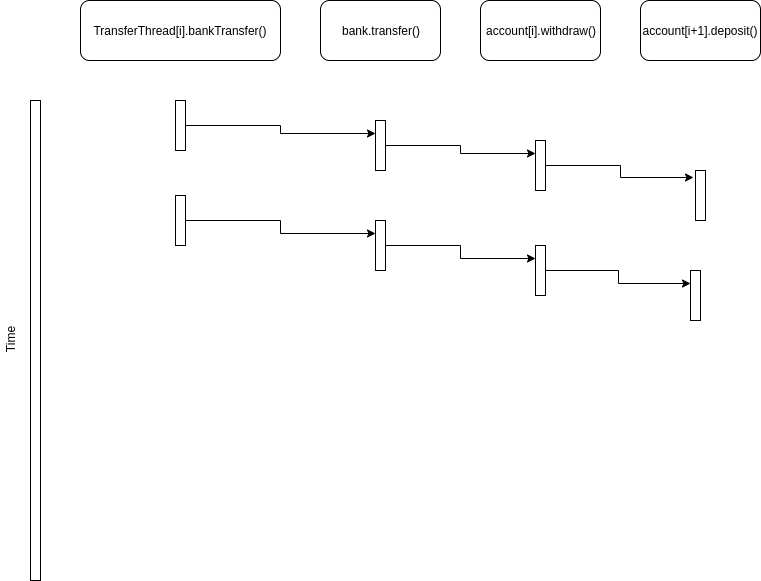
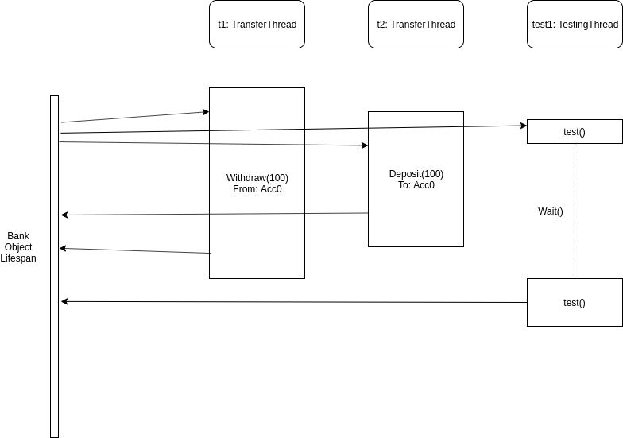

# BankSim

## Task 1

 
The race condition may occur when multiple threads "override" each other when setting the deposit amount or the withdrawal amount. This can happen when, for instance, thread A withdraws $100 dollars and deposits it into thread B but at the same time thread C withdraws $100 dollars and deposits it into thread B as well. If they both are in the function to do the depositing (account.deposit()) into account C, and both obtain the current balance of $10,000, then they will each add $100 dollars to the current balance ($10,000) and will each individually set the output balance to $10,100. The actual account balance of account C should be $10,200 after these two deposits.

## Task 2
x

## Task 3

 
x

## Task 4
x

## Task 5
x

## Requirements
x

## Teamwork
x

## Testing
x
